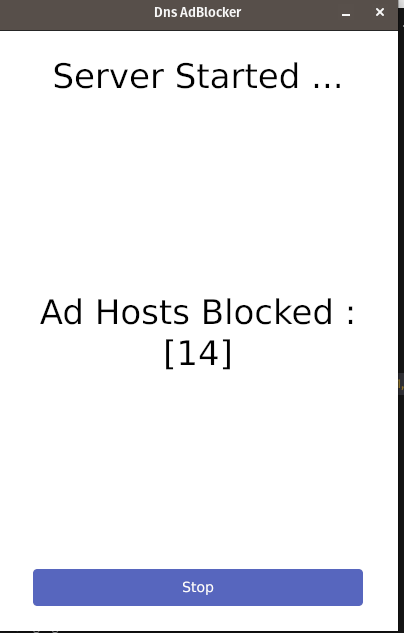

# 🛡️ Local AdBlocker (Go + Gio)

A fast, local-first adblocker written in **Go**, featuring a beautiful **Gio-powered GUI**, a custom **local DNS server**, and first-class support for **Windows**. Designed to be **lightweight**, **privacy-respecting**, and eventually **cross-platform**.

---

## ✨ Features

-   🚫 **Ad & Tracker Blocking** via local DNS filtering
-   🖥️ **Gio GUI**: Clean, modern UI for controlling and monitoring DNS activity
-   🪟 **First-Class Windows Support**: Easy install and tray integration
-   🌍 **Cross-Platform by Design**: Targeting Linux and macOS in upcoming releases
-   🛠️ **Customizable Hosts & Blocklists**
-   📊 Real-time DNS query logs and blocking stats

---

## 🚀 Getting Started

### Prerequisites

-   [Go 1.21+](https://golang.org/dl/)
-   Windows 10/11 (for full support)
-   Admin privileges (to bind to port 53 and modify DNS settings)

### Installation

```bash
git clone https://github.com/baderkha/dns-no-ads
cd dns-no-ads
go run .\cmd\client\main.go
```

> ⚠️ On Windows, run as administrator for proper DNS interception.

---

## 🧠 How It Works

-   **DNS Proxy Server**: Intercepts all DNS requests from your machine.
-   **Blocklist Matching**: Domains are checked against filter rules and known ad/tracker lists.
-   **Gio UI**: Provides a 1 click toggle feature to turn on the filtering local server and turn it off

---

##  Screen shot




---

## 🧪 Roadmap

-   [x] Local DNS blocking
-   [x] Gio UI for query logs and stats
-   [x] Windows support
-   [x] Linux Support
-   [ ] Darwin Support
-   [ ] Auto-updating blocklists
-   [ ] Per-app/domain filtering controls

---

## 🙌 Contributing

Pull requests, feature suggestions, and issue reports are welcome!

---

## 📜 License

MIT License. See [LICENSE](./LICENSE) for details.

---

## 💬 Acknowledgements

-   [gioui.org](https://gioui.org/) – for the GUI framework
-   [Go DNS libraries](https://pkg.go.dev/github.com/miekg/dns)
-   [Hagezi](https://github.com/hagezi/dns-blocklists) - Open source blocklist maintainers ❤️
